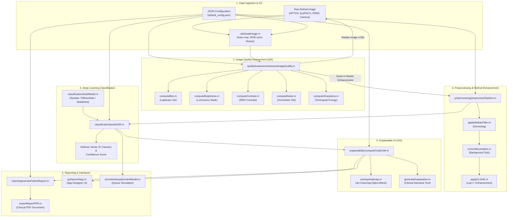

# System Architecture: Explainable AI-Based Diabetic Retinopathy Screening System

**Smart India Hackathon Problem Statement:** SIH26038  
**System Designation:** Rural PHC Autonomous & Semi-Autonomous Retinal Diagnostic Pipeline

---

## 1. Modular Architectural Overview

The system is architected into 12 decoupled, production-grade subsystems designed for deployment on edge laptops and low-resource mobile health vans in rural India.

---

## 2. Subsystem Interface Specifications

### Module 1: Configuration (`config/`)
- **`default_config.json`**: Single source of truth. Contains file paths, dataset split ratios, image preprocessing parameters, neural network hyperparameters, IQA score weights, Grad-CAM settings, and rural deployment flags.
- **`utils/loadConfig.m`**: Parses JSON, validates schema integrity, and automatically maps all relative paths to resolved absolute system paths.

### Module 2: Data Loader (`data/`)
- Ingests datasets: **APTOS 2019**, **EyePACS**, **IDRiD**, and **Messidor-2**.
- Verifies label CSV integrity, filters missing or corrupted image files, and creates stratified train/validation/test partitions.

### Module 3: Image Quality Assessment (`qualityAssessment/`)
- Acts as a clinical gatekeeper at rural camps.
- Evaluates 5 orthogonal visual metrics (Blur, Brightness, Contrast, Noise, Sharpness).
- Returns composite score in $[0, 100]$ and categorical status (`Good`, `Needs Enhancement`, `Retake Image`).

### Module 4: Retinal Preprocessing & Enhancement (`preprocessing/`)
- Suppresses sensor impulse noise via median filtering.
- Removes non-uniform illumination and vignetting artifacts.
- Enhances microvascular lesions (microaneurysms, hemorrhages, exudates) via **L\*a\*b\* CLAHE**.

### Module 5 & 6: Classification & Inference (`classification/`, `training/`)
- Supports state-of-the-art transfer learning backbones: `ResNet18`, `ResNet50`, `EfficientNet-B0`, `MobileNetV2`.
- `predictDR.m` outputs structured diagnosis: DR stage code (0–4), stage label, confidence percentage, 5-class probability vector, latency, and referral status.

### Module 7: Explainable AI (`explainability/`)
- Generates **Grad-CAM** activation maps highlighting microvascular lesions.
- Generates natural language clinical justification explaining model focus to rural health workers.

### Module 8: Clinical Reporting (`reports/`)
- Compiles patient demographics, original fundus, CLAHE image, Grad-CAM overlay, prediction metrics, and doctor sign-off.
- Exports publication-grade clinical reports in PDF and high-res image formats.

### Module 9: MATLAB App Designer GUI (`gui/`)
- Complete 9-page touch-optimized interface featuring Dashboard, Upload, IQA, Enhancement, Prediction, Explainability, Reports, Settings, and Results history.

### Module 10: Simulink Workflow Simulation (`simulink/`)
- Discrete-event queue model tracking patient arrival, capture, AI inference, remote doctor review, and referral triage.

### Module 11: Testing & Verification (`testing/`)
- Automated unit test suite using MATLAB's `matlab.unittest` framework covering utilities, IQA algorithms, and inference interfaces.
