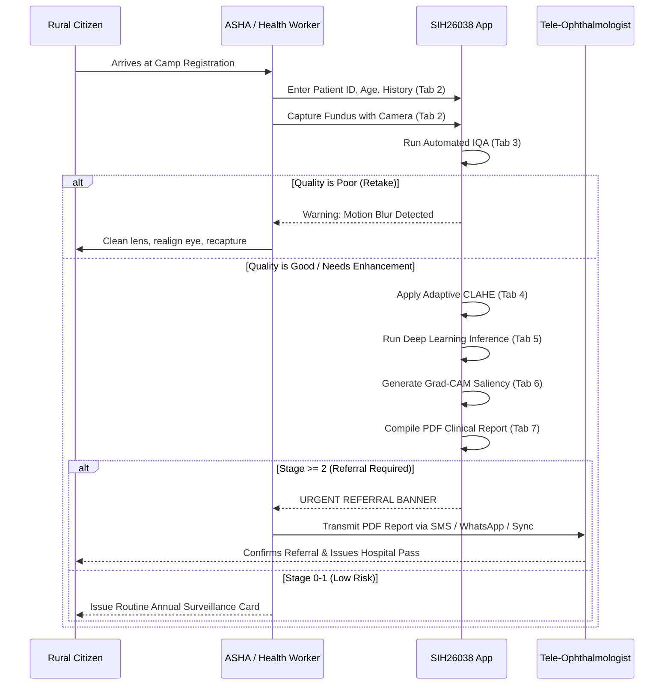

# SIH26038: Clinical GUI Application User Manual & SOP
## Explainable AI-Based Diabetic Retinopathy Screening System for Rural India

---

## 1. System Overview

The **SIH26038 Clinical GUI** is a standalone, full-featured MATLAB App Designer desktop application designed for deployment at rural Primary Health Centres (PHCs), Community Health Centres (CHCs), and mobile tele-ophthalmology screening camps across India. 

Operating completely **offline** on standard edge computing hardware (laptops, mini-PCs, or rugged tablets), it empowers Accredited Social Health Activists (ASHAs), auxiliary nurse midwives (ANMs), and general practitioners to perform automated, high-accuracy retinal screenings without requiring an on-site retina specialist.

```
+---------------------------------------------------------------------------------------------------+
|                           SIH26038 RETINAL SCREENING APP DESIGNER ARCHITECTURE                    |
+---------------------------------------------------------------------------------------------------+
|  [Sidebar Navigation]  |  [Active Tab Content Panel]                                              |
|  - 1. Dashboard        |   - Real-time Visualizations & Interactive Clinical Controls             |
|  - 2. Upload Image     |   - Responsive Multi-Resolution UIAxes Renderers                         |
|  - 3. Quality Check    |   - Objective IQA Factor Gauges & Categorical Verdict Badges             |
|  - 4. Enhancement      |   - Dual Split-Screen CLAHE & Illumination Comparison                    |
|  - 5. Prediction       |   - 5-Class Softmax Probability Bar Charts & Referral Urgency Banner     |
|  - 6. Explainability   |   - Interactive Grad-CAM Heatmap (\alpha Slider & Colormap Selector)     |
|  - 7. Clinical Report  |   - Demographic Entry, Live Tele-Medicine Preview & 1-Click PDF Export    |
|  - 8. Settings         |   - Model Backbone, Referral Threshold & Rural Camp Metadata Tuning      |
|  - 9. Results History  |   - Filterable Patient Audit Table & Cohort CSV / Spreadsheet Export     |
|  [Operator Status Bar] |  [System State: Ready | Edge CPU/GPU Accelerated | Offline Mode Active]  |
+---------------------------------------------------------------------------------------------------+
```

---

## 2. Launching the Application

### Option A: From the MATLAB Command Window
```matlab
% Run startup to initialize paths and environment
startup

% Launch the graphical application
app = launchApp();
```

### Option B: Programmatic Instantiation (Headless / Unit Test Mode)
```matlab
% Instantiate directly as an AppBase object
app = DRScreeningApp_exported();

% Switch to any tab (e.g., Tab 5 - Prediction)
app.navigateToTab(5);

% Load a sample fundus image (Stage 3 - Severe NPDR)
app.loadTestSample(3);

% Run automated quality assessment
app.runTestQuality();
```

---

## 3. Tab-by-Tab User Guide

### Tab 1: Dashboard
- **Purpose**: Provides health workers and camp coordinators with real-time operational statistics for the active screening camp.
- **Key Indicators**:
  - **Patients Screened Today**: Total count of individuals registered and examined.
  - **Normal / Low Risk (Stage 0-1)**: Count and percentage of patients requiring routine primary care follow-up.
  - **Referrals Required (Stage 2+)**: Count and percentage of patients flagged for secondary/tertiary ophthalmologist consults.
  - **Average Quality Score**: Overall percentage of images meeting clinical standards on initial capture.
- **Recent Camp Screenings Table**: Shows the last 6 screened patients with immediate referral status badges.
- **Quick Action**: `+ Start New Patient Screening` instantly directs the user to the Upload Image tab.

### Tab 2: Upload Image
- **Purpose**: Capture or load retinal fundus imagery and bind it to unique patient demographics.
- **Demographic Inputs**:
  - `Patient ID`: Unique alphanumeric identifier (e.g., `PAT-2026-0892` or Aadhaar-masked ID).
  - `Full Name`, `Age`, `Gender`, `Eye Tested` (Right Eye [OD] / Left Eye [OS]), and `Diabetes Duration` (years).
- **Acquisition Source Dropdown**:
  - Supports handheld smartphone fundus cameras (Remidio NM-FOP), non-mydriatic desktop cameras (Forus 3nethra, Topcon TRC-NW400), local disk files, and in-memory synthetic validation cases.
- **Fundus Preview Axes**:
  - Renders the uncompressed fundus photograph at full native aspect ratio.
  - Displays real-time image resolution ($W \times H$), channels, and color space metadata.

### Tab 3: Quality Assessment (IQA)
- **Purpose**: Prevent erroneous AI diagnoses caused by out-of-focus, under-illuminated, or hazy fundus captures.
- **Action**: Click `Assess Retinal Image Quality (IQA)`.
- **Verdict Badges**:
  - `GOOD - CLINICALLY ADEQUATE` (Green): Proceed directly to enhancement or prediction.
  - `NEEDS ENHANCEMENT` (Amber): Illumination or contrast is suboptimal; contrast enhancement is recommended.
  - `RETAKE IMAGE (POOR QUALITY)` (Red): Image exhibits severe motion blur, pupil obstruction, or extreme underexposure. The operator is instructed to clean the camera lens, adjust ambient lighting, and retake the photo.
- **Factor Breakdown**:
  - Blur Metric (modified Laplacian variance)
  - Mean Retinal Brightness ($0-255$)
  - Root-Mean-Square (RMS) Contrast
  - Edge Sharpness (gradient energy)
  - Noise Sigma (high-frequency wavelet noise)

### Tab 4: Image Enhancement
- **Purpose**: Enhance microvascular lesions, microaneurysms, and hemorrhages while preserving natural retinal anatomical geometry.
- **Dual Side-by-Side Display**:
  - Left Axes: Acquired Raw Fundus
  - Right Axes: Enhanced Fundus
- **Interactive Controls**:
  - `CLAHE Clip Limit Slider`: $0.005$ to $0.05$ (default: $0.02$). Higher values increase local contrast.
  - `Illumination Correction Checkbox`: Applies large-kernel morphological closing to eliminate non-uniform vignetting and flash artifacts.
  - `Noise Reduction Checkbox`: Applies edge-preserving median filtering.
- **Quantitative Fidelity Metrics**:
  - **PSNR**: Peak Signal-to-Noise Ratio ($> 30\text{ dB}$ guarantees low distortion).
  - **SSIM**: Structural Similarity Index ($> 0.92$ ensures structural fidelity).
  - **Contrast Gain**: Relative improvement ratio in retinal dynamic range.

### Tab 5: Prediction (Deep Learning Inference)
- **Purpose**: Classify diabetic retinopathy severity into the 5-stage International Clinical Diabetic Retinopathy (ICDR) scale.
- **Action**: Click `Run AI DR Inference Engine`.
- **Clinical Outputs**:
  - **Predicted Stage Badge**: Color-coded indicator:
    - *Stage 0 - No DR* (Green)
    - *Stage 1 - Mild NPDR* (Light Green)
    - *Stage 2 - Moderate NPDR* (Amber)
    - *Stage 3 - Severe NPDR* (Orange)
    - *Stage 4 - Proliferative DR (PDR)* (Red)
  - **Model Confidence**: Confidence percentage (e.g., $94.6\%$).
  - **Inference Latency**: Execution time in milliseconds (typically $35-65\text{ ms}$ on edge CPUs).
  - **Referral Action Banner**:
    - `NO URGENT REFERRAL`: Routine annual screening recommended.
    - `URGENT REFERRAL REQUIRED`: Tele-ophthalmology referral within 1-2 weeks or emergency referral within 48 hours.
  - **Class Probability Bar Chart**: Horizontal bar plot illustrating softmax probabilities across all 5 stages.

### Tab 6: Explainability (Grad-CAM Saliency)
- **Purpose**: Provide visual proof and natural language reasoning behind the AI's classification to build trust among clinicians and patients.
- **Visual Display**:
  - Fundus image blended with Grad-CAM activation heatmap showing the exact retinal regions triggering the diagnosis.
- **Interactive Controls**:
  - `Opacity (\alpha) Slider`: Adjust heatmap transparency from $0.0$ (fundus only) to $1.0$ (pure heatmap).
  - `Colormap Selector`: Choose between *Jet*, *Hot*, *Turbo*, and *Parula*.
  - `Lesion Highlighting Toggle`: Automatically highlights microaneurysms, hemorrhages, and hard exudates.
- **Clinical Justification Text**:
  - Summarizes the anatomical location of peak saliency (e.g., *superior-temporal arcade*, *macular periphery*).
  - Details lesion counts and clinical criteria concordance (e.g., *4-2-1 rule for Severe NPDR*).

### Tab 7: Clinical Report
- **Purpose**: Generate standardized, medico-legally compliant PDF reports for tele-consultation, referral handoffs, and patient records.
- **Report Contents**:
  1. Patient demographics, Aadhaar-masked ID, age, and camp location.
  2. Tri-image panel: Raw Fundus, Enhanced Fundus, and Grad-CAM Saliency Map.
  3. Image Quality Assessment metrics and verdict.
  4. AI Diagnosis, ICDR Stage, and confidence percentage.
  5. Explainable AI clinical rationale and lesion breakdown.
  6. Actionable referral recommendation and timeline for tertiary care.
- **Actions**:
  - `Generate & Export Full PDF Report`: Compiles report and saves PDF to `results/reports/`.
  - `Open Generated Report PDF`: Launches default system PDF viewer.
  - `Export Structured JSON Audit`: Generates machine-readable FHIR/JSON records for Ayushman Bharat Digital Mission (ABDM) integration.

### Tab 8: Settings & Calibration
- **Model Backbone**: Choose between `resnet50`, `resnet18`, `efficientnetb0`, and `mobilenetv2`.
- **Input Resolution**: Select $224 \times 224$, $256 \times 256$, or $512 \times 512$.
- **Referral Threshold**: Define stage threshold triggering automated referral warnings (default: Stage 2).
- **IQA Tuning**: Sliders for blur sensitivity, min/max allowable brightness, and contrast cutoffs.
- **Camp & Clinic Metadata**: Update Camp ID, Primary Health Centre name, District, State, and Operator credentials.
- **Save / Reset**: Persist configuration changes directly to `config/default_config.json`.

### Tab 9: Results & Audit History
- **Purpose**: View, search, and export historical patient records examined during the camp.
- **Filter & Search**:
  - Real-time search by Patient ID or Name.
  - Dropdown filter by DR Stage (All, Stage 0, Stage 1, Stage 2, Stage 3, Stage 4, or Referral Required Only).
- **Cohort Audit Summary**: Instant statistics showing total records, referral percentages, and normal rates.
- **Export Action**: `Export Cohort Audit to CSV / Excel Report` writes `results/reports/screening_cohort_audit.csv`.

---

## 4. Standard Operating Procedure (SOP) for Rural Camps



---

## 5. Keyboard Shortcuts & Accessibility

| Action | Keyboard Shortcut | Function |
| :--- | :--- | :--- |
| **Go to Dashboard** | `Ctrl + 1` | Switch to Tab 1 |
| **Go to Upload** | `Ctrl + 2` | Switch to Tab 2 |
| **Go to Quality** | `Ctrl + 3` | Switch to Tab 3 |
| **Go to Enhancement**| `Ctrl + 4` | Switch to Tab 4 |
| **Go to Prediction** | `Ctrl + 5` | Switch to Tab 5 |
| **Go to Explainability**| `Ctrl + 6` | Switch to Tab 6 |
| **Go to Report** | `Ctrl + 7` | Switch to Tab 7 |
| **Go to Settings** | `Ctrl + 8` | Switch to Tab 8 |
| **Go to Results** | `Ctrl + 9` | Switch to Tab 9 |
| **Browse Image** | `Ctrl + O` | Open file chooser dialog |
| **Run Inference** | `Ctrl + Enter`| Run AI prediction on active image |
| **Generate Report** | `Ctrl + P` | Compile and export PDF report |

---

## 6. Technical Specifications & Requirements

- **MATLAB Version**: R2021b or later (Image Processing Toolbox, Deep Learning Toolbox).
- **Minimum RAM**: 4 GB (8 GB recommended for batch operations).
- **Display Resolution**: $1280 \times 800$ minimum (Optimized for $1920 \times 1080$ Full HD).
- **Edge Deployment**: Fully capable of CPU-only inference on Intel Core i3/i5 or AMD Ryzen mobile processors.
- **Operating Systems**: Windows 10/11, Linux (Ubuntu 20.04+), macOS (Intel / Apple Silicon).
