# System Design Document (SDD)
## Explainable AI-Based Diabetic Retinopathy Screening System for Rural India
### Standard: IEEE Std 1016-2009 Software Design Description
### Project Code: SIH26038 | Version: 1.0.0-Production | Date: September 2026

---

## 1. System Architecture Overview

The **SIH26038 Retinal Screening System** is structured as a five-tier decoupled architecture separating hardware acquisition, image processing pipelines, deep learning inference, explainable AI, clinical reporting, and interactive presentation:

```
+---------------------------------------------------------------------------------------------------+
|                                      FIVE-TIER SYSTEM ARCHITECTURE                                |
+---------------------------------------------------------------------------------------------------+
|                                                                                                   |
|  [PRESENTATION TIER]                                                                              |
|  - MATLAB App Designer 18-View Clinical Workstation (gui/DRScreeningApp_exported.m)               |
|  - Light / Dark Mode Theme Engine | Interactive Visualizers | Toast Notification Hub              |
|                                         |                                                         |
|                                         v                                                         |
|  [APPLICATION & WORKFLOW TIER]                                                                    |
|  - Master Orchestration Controller (main.m) | Discrete-Event Queue Engine (simulink/)              |
|  - Patient Demographics & State Manager | Offline Session Cache                                   |
|                                         |                                                         |
|                                         v                                                         |
|  [CLINICAL AI & COMPUTATIONAL TIER]                                                               |
|  - Image Quality Assessment Gate (qualityAssessment/assessImageQuality.m)                         |
|  - Retinal Preprocessing & CLAHE Enhancement (preprocessing/preprocessPipeline.m)                 |
|  - Transfer-Learned 5-Stage ICDR Classifier (classification/predictDR.m)                          |
|  - Grad-CAM Heatmap & Lesion Segmentation Engine (explainability/computeGradCAM.m)                |
|                                         |                                                         |
|                                         v                                                         |
|  [REPORTING & DISPATCH TIER]                                                                      |
|  - Clinical PDF Document Assembler (reports/generatePatientReport.m, exportReportPDF.m)           |
|  - Multi-Format Export Hub (PNG Summary, MAT Raw Data, CSV Roster, FHIR JSON Record)             |
|                                         |                                                         |
|                                         v                                                         |
|  [DATA PERSISTENCE & HARDWARE TIER]                                                               |
|  - Centralized JSON Configs (config/) | Image Datastores (data/) | Model Weights (models/)         |
|  - Portable Fundus Camera Mounts (Remidio, Forus, Topcon) | Physical Label Printers               |
+---------------------------------------------------------------------------------------------------+
```

---

## 2. Data Flow Diagrams (DFD)

### 2.1 DFD Level 0 (Context Diagram)
The Level 0 Context Diagram depicts the interaction between external human and hardware actors and the core SIH26038 AI system boundary:

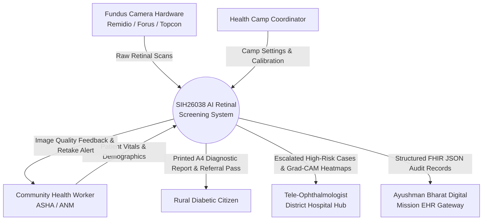

### 2.2 DFD Level 1 (Operational Decomposition)
The Level 1 DFD decomposes the system into its six core operational processes and data stores:

```mermaid
graph TD
    P1[1.0 Patient Intake & Ingestion]
    P2[2.0 Image Quality Assessment Gate]
    P3[3.0 Retinal Preprocessing & CLAHE]
    P4[4.0 Deep Learning 5-Stage Inference]
    P5[5.0 Grad-CAM Explainability Engine]
    P6[6.0 Clinical Report Generation]

    D1[(D1: Active Patient Store)]
    D2[(D2: System Configuration)]
    D3[(D3: Model Weights Checkpoints)]
    D4[(D4: Historical Screening Database)]

    CAMERA[Fundus Camera] -->|Digital Image| P1
    ASHA[ASHA Worker] -->|Demographics| P1
    P1 -->|Stored Record| D1
    P1 -->|Normalized Fundus| P2
    D2 -.->|IQA Thresholds| P2

    P2 -- "Overall Score < 50" --> RETAKE[Field Retake Alert]
    P2 -- "Score >= 50" -->|Quality Verified Fundus| P3
    D2 -.->|CLAHE Clip Limit| P3

    P3 -->|Enhanced Fundus| P4
    D3 -.->|ResNet50 Weights| P4
    P4 -->|Predicted Stage & Softmax| P5
    P3 -->|Feature Maps| P5

    P4 -->|Prediction Data| P6
    P5 -->|Grad-CAM Saliency| P6
    P2 -->|IQA Scores| P6
    D1 -->|Patient Demographics| P6

    P6 -->|Final PDF Report| D4
    P6 -->|Visual Output| GUI[18-Page App Designer GUI]
```

### 2.3 DFD Level 2 (Subsystem: AI Inference & Explainability)
Decomposes processes 4.0 and 5.0 into deep learning feature extraction, classification, gradient backpropagation, lesion segmentation, and text synthesis:

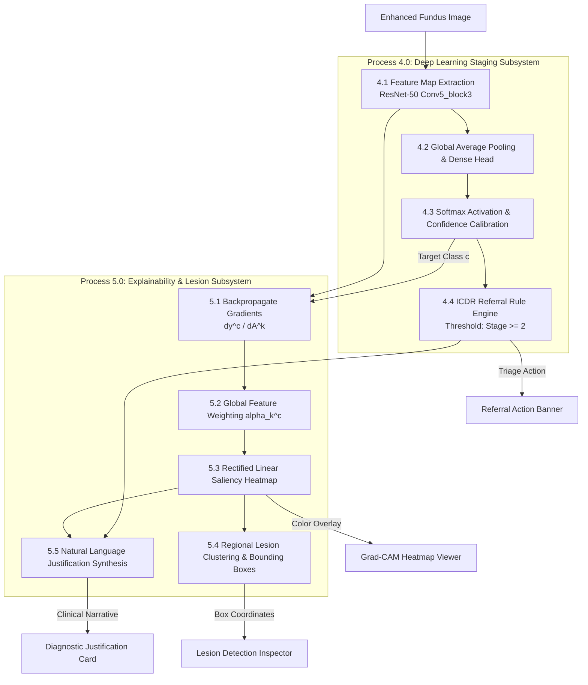

---

## 3. Unified Modeling Language (UML) Diagrams

### 3.1 Use Case Diagram
Illustrates all system interactions across the four primary human actors:

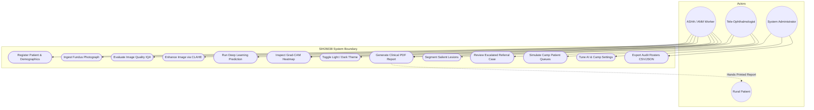

### 3.2 Class Diagram
Defines the object-oriented structure, domain models, and UI controller classes:

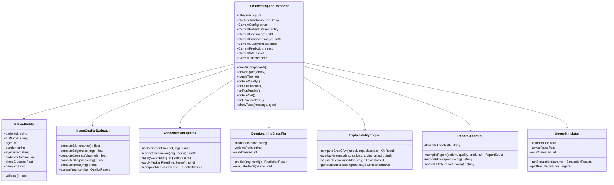

### 3.3 Sequence Diagram: End-to-End Patient Screening Flow
Illustrates sequential message passing during active patient examination:

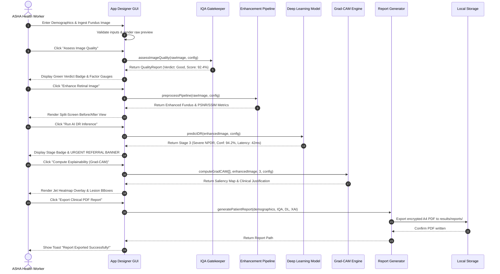

### 3.4 Sequence Diagram: Tele-Ophthalmology Referral Escalation
Illustrates the remote specialist consultation workflow for high-risk patients:

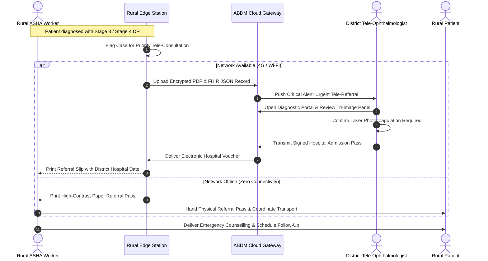

### 3.5 Activity Diagram: Patient Screening Lifecycle
Shows control flow and decision branches through quality gates and referral thresholds:

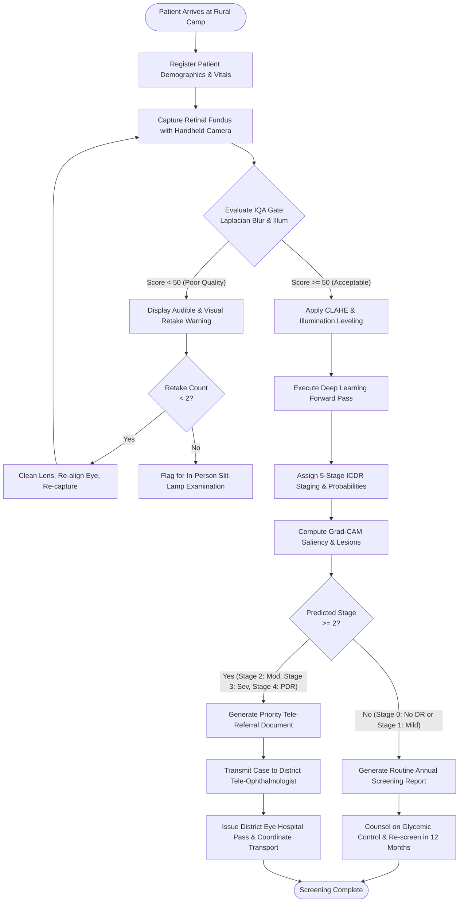

### 3.6 State Machine Diagram: Patient Screening State
Defines the discrete state transitions of a patient record inside the application:

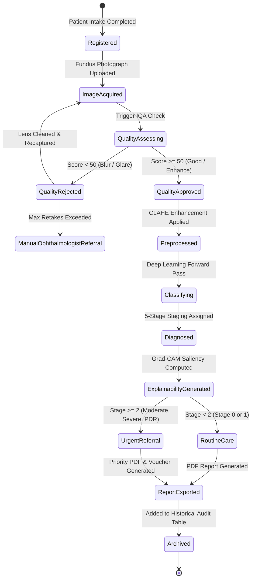

### 3.7 Component Diagram
Shows physical software modules and runtime dependency linkages:

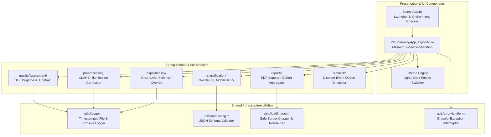

### 3.8 Deployment Diagram
Illustrates edge hardware deployment in rural Primary Health Centres vs District Cloud:

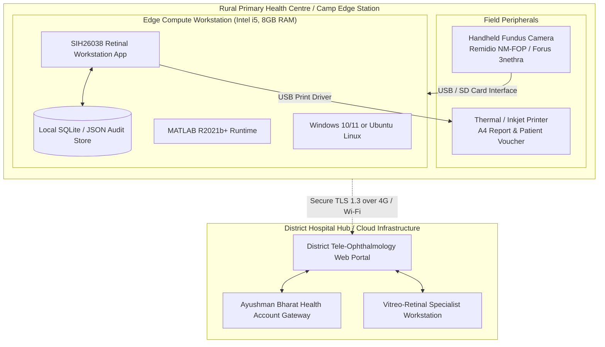

### 3.9 Package Diagram
Defines namespace packaging and subsystem directory boundaries:

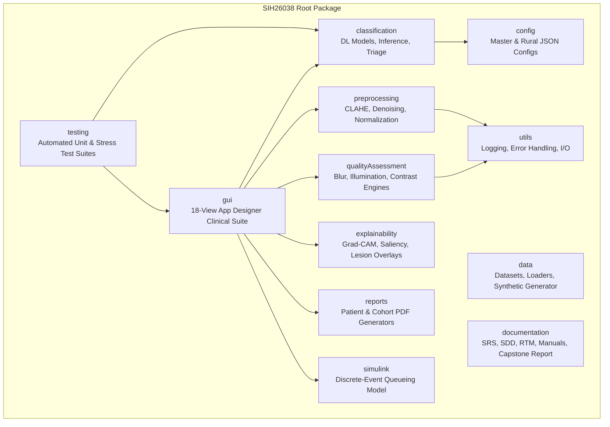

---

## 4. System & Program Flowcharts

### 4.1 System Flowchart
Depicts high-level physical document and digital data flow throughout rural screening operations:

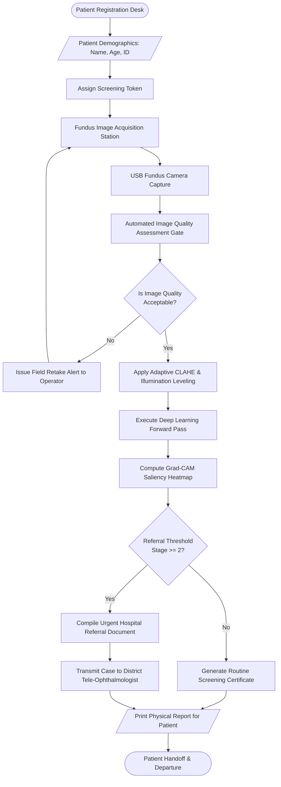

### 4.2 Program Flowchart
Detailed algorithmic control flow of the core MATLAB inference and explainability engine:

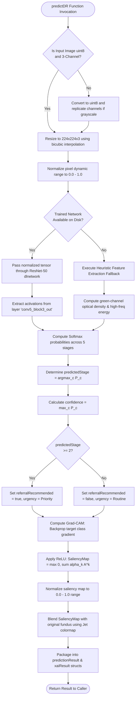
